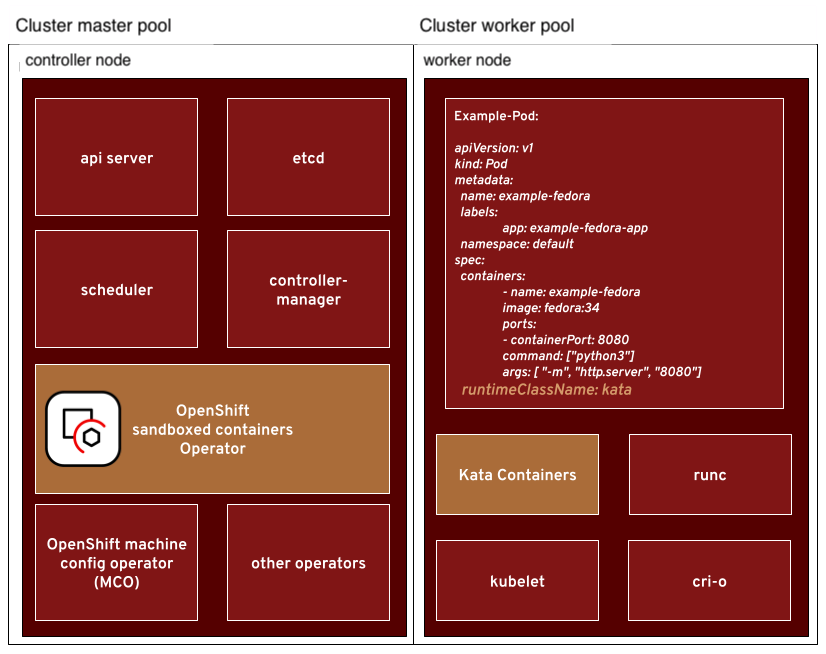

<!-- TOC start -->
- [Introduction to sandboxed containers](#introduction-to-sandboxed-containers)
  * [Features & benefits of sandboxed containers](#features-benefits-of-sandboxed-containers)
- [OpenShift sandboxed containers Operator](#openshift-sandboxed-containers-operator)
  * [Operator Architecture](#operator-architecture)
  * [KataConfig Custom Resource Definition](#kataconfig-custom-resource-definition)
  * [Getting Started](#getting-started)
- [Operator Development](#operator-development)
- [Demos](#demos)
- [Further Reading](#further-reading)
<!-- TOC end -->

## Introduction to sandboxed containers

[OpenShift sandboxed containers](https://www.redhat.com/en/openshift-sandboxed-containers), based on the [Kata Containers](https://katacontainers.io/) open source project, provides an Open Container Initiative (OCI) compliant container runtime using lightweight virtual machines, running your workloads in their own isolated kernel and therefore contributing an additional layer of isolation back to OpenShift’s Defense-in-Depth strategy. 

### Features & benefits of sandboxed containers

- **Isolated Developer Environments & Privileges Scoping** 
As a developer working on debugging an application using state-of-the-art tooling you might need elevated privileges such as `CAP_ADMIN` or `CAP_BPF`. With OpenShift sandboxed containers, any impact will be limited to a separate dedicated kernel.

- **Legacy Containerized Workload Isolation** 
You are mid-way in converting a containerized monolith into cloud-native microservices. However, the monolith still runs on your cluster unpatched and unmaintained. OpenShift sandboxed containers helps isolate it in its own kernel to reduce risk.

- **Safe Multi-tenancy & Resource Sharing (CI/CD Jobs, CNFs, ..)** 
If you are providing a service to multiple tenants, it could mean that the service workloads are sharing the same resources (e.g., worker node). By deploying in a dedicated kernel, the impact of these workloads have on one another is greatly reduced.

- **Additional Isolation with Native Kubernetes User Experience**
OpenShift sandboxed containers is used as a compliant OCI runtime. Therefore, many operational patterns used with normal containers are still preserved including but not limited to image scanning, GitOps, Imagestreams, and so on.

Please refer to this [blog](https://cloud.redhat.com/blog/the-dawn-of-openshift-sandboxed-containers-overview) for a detailed overview of sandboxed containers use cases and other related details.

## OpenShift sandboxed containers Operator

The operator manages the lifecycle (`install/configure/update`) of sandboxed containers runtime (`Kata containers`) on OpenShift clusters.

### Operator Architecture

The following diagram shows how the operator components are connected to the OpenShift overall architecture:

Here is a brief summary of the components:

- OpenShift clusters consist of controller and worker nodes organized as  machine config pools. 
- The Machine Config Operator (MCO) manages the operating system and keeps the cluster up to date and configured.
- The control-plane nodes run all the services that are required to control the cluster such as the API server, etcd, controller-manager, and the scheduler. 
- The OpenShift sandboxed containers operator runs on a control plane node.
- The cluster worker nodes run all the end-user workloads. 
- The container engine `CRI-O` uses either the default container runtime `runc` or, in sandboxed containers case, the `Kata` containers runtime.

### KataConfig Custom Resource Definition

The operator owns and control the `KataConfig` Custom Resource Definition (CRD).
Please refer to the [code](https://github.com/openshift/sandboxed-containers-operator/blob/master/api/v1/kataconfig_types.go) to find details of the `KataConfig` CRD. 

### Getting Started

Please refer to the OpenShift release specific documentation for getting started with sandboxed containers. 
- For OpenShift 4.9 please follow this [doc](https://docs.openshift.com/container-platform/4.9/sandboxed_containers/deploying-sandboxed-container-workloads.html)

Further note that starting with OpenShift 4.9, the branch naming is tied to the operator version and not the OpenShift version.
For example `release-1.1` corresponds to the Operator release verson `1.1.x`.

## Operator Development

Please take a look at the following [doc](./docs/DEVELOPMENT.md). 
Contributions are most welcome!!

## Demos

You can find various demos in the following [youtube channel](https://www.youtube.com/channel/UC6PCt2zbug9cF4SpnMrE68A).

## Further Reading

- [OpenShift sandboxed containers 101](https://cloud.redhat.com/blog/openshift-sandboxed-containers-101)
- [Operator overview](https://cloud.redhat.com/blog/openshift-sandboxed-containers-operator-from-zero-to-hero-the-hard-way)
- [Troubleshooting](https://cloud.redhat.com/blog/sandboxed-containers-operator-from-zero-to-hero-the-hard-way-part-2)
